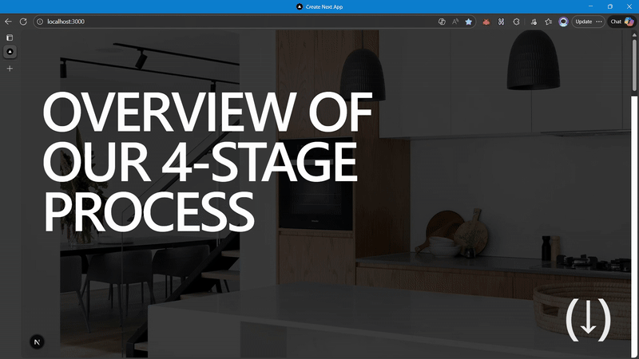

# Sticky Scroll Stack

A Next.js project showcasing a high-performance "stacking card" interaction inspired by [OH Architecture](https://www.oharchitecture.com.au/process). This component features a Swiss Grid layout, depth-based scaling, and delayed physics-based animations.

## Demo

<p align="center">
  
</p>

## Features

- **Hybrid Sticky System:** Uses native CSS `sticky` for performance combined with GSAP `ScrollTrigger` for animation state.
- **Physics-Based Animation:** Custom GSAP logic implementing delayed rotation for a realistic "stacking" feel.
- **Delayed Trigger Logic:** Cards "wait" to animate until the next card has traveled 10% up the viewport, preventing premature movement.
- **Swiss Grid Layout:** A clean, typography-heavy layout using Tailwind CSS.
- **Smooth Inertia:** Integrated with **Lenis** for buttery smooth scroll momentum.

## Getting Started

1. **Install dependencies:**

   ```sh
   bun install
   ```

2. **Run the development server:**

   ```sh
   bun run dev
   ```

   Open http://localhost:3000 in your browser.

## Logic & Architecture

### The "Wait-to-Rotate" Physics
Unlike standard parallax effects, this component decouples the pinning from the animation.

- **Pinning:** Happens immediately at top -20px using CSS sticky.
- **Animation:** The rotation only triggers when the next card hits top 90% (meaning it has risen 10% of the way up the screen). This creates a "weighty" feel where the card holds its ground before retreating.

### Animation Details
The depth effect is simulated using:

1. `scale`: Reduces size as the next card overlaps.
2. `rotation`: Tilts the card slightly (alternating positive/negative) to simulate stacking irregularity.
3. `opacity`: Darkens the card via an overlay for focus management.

## Project Structure

- `src/app/` — Next.js app directory
- `src/components/StickyCards.tsx` — Main animation logic & layout
- `public/images/` — Assets

## Customization

To adjust the "heaviness" of the scroll interaction, modify the start value in `StickyCards.tsx`:

```javascript
// Triggers sooner (lighter feel)
start: "top 90%"

// Triggers later (heavier feel)
start: "top 50%"
```

## License

MIT
